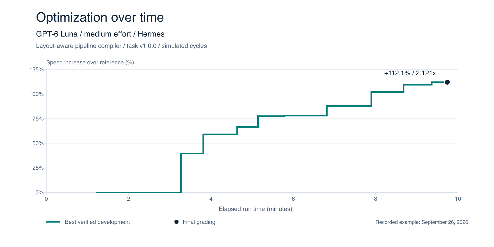

# SPEEDUP-MARK

**The problem:** Most pass/fail benchmarks become stale and saturate as AI models become smarter. They measure a binary outcome.

**The goal:** Use hard optimization tasks to measure the “percent speed up” a model can achieve. These tasks are designed to be attempted by any model but provide lots of runway for even smarter models to optimize.

Models tweak and submit their `candidate.py` to a central grader, so we can track their progress over the course of a run. Each submission must preserve verified correctness.

Speedup is reference cost divided by candidate cost: **2.000x means twice as fast, a 100% speed increase**.



Recorded example from September 26, 2026, using task v1.0.0 and simulated cycles. Final grading measured **2.121x (+112.1%)**. [Chart data](diagrams/luna-hermes-progress.json).

## PRE REQ

- **Python 3.10+** and a local copy of this repository. Run commands from the repository root.
- **Standard library only** for the `smoke` and `extended` suites. Some additional tasks need the optional packages in [requirements-numerical.txt](requirements-numerical.txt); its wheel hashes target macOS arm64 and CPython 3.14.
- **Your chosen agent harness**, if you want an agent to optimize the code. Direct grading runs the local candidates without launching a model.

No SPEEDUP-MARK package installation, containers, services, model downloads, or GPU is required.

## USAGE

Create a task run:

```console
python3 -m speedupmark run create temporal_asof_join \
  --harness my-agent --model exact-model-id --effort medium
```

Give your agent the printed workspace path on the same machine. It reads `prompt.md` and the task README, edits `candidate.py`, and submits each attempt by running this command inside the workspace:

```console
python3 grade.py
```

When the agent stops, finish the run and view its results from the repository root:

```console
python3 -m speedupmark run finish runs/<id>
python3 -m speedupmark run report runs/<id>
```

To create and run a task suite, supply your harness’s noninteractive command, configured for the model and effort you record:

```console
python3 -m speedupmark run launch smoke \
  --harness my-agent --model exact-model-id --effort medium \
  --command my-agent
```

Replace `my-agent` with your harness command. The prompt is passed on stdin; each task gets a fresh workspace. Use `smoke` for 10 tasks, `extended` for 26, or `all` for all 50, including the starter template. You can also launch one task by using its directory name.

View the suite results using the printed suite path:

```console
python3 -m speedupmark run report runs/suite-<id>
python3 -m speedupmark run report runs/suite-<id> --json
```

Reports include progress measurements and final scores. Final grading selects the fastest correct recorded candidate and evaluates it on fresh seeds by default. Wall-clock comparisons need the same machine and Python version.

## COMMANDS

| Command | Purpose |
| --- | --- |
| `python3 -m speedupmark all --list` | List all 50 tasks |
| `python3 grade.py` | Submit the candidate and record progress from inside a run workspace |
| `python3 -m speedupmark run evaluate runs/<id>` | Submit the workspace candidate from the repository root |
| `python3 -m speedupmark run finish runs/<id>` | Finish a manually handed-off run and grade its best verified candidate |
| `python3 -m speedupmark run report runs/<id>` | View a task run’s progress and results |
| `python3 -m speedupmark run report runs/suite-<id>` | View suite results; add `--json` for the full report |
| `python3 -m speedupmark temporal_asof_join` | Grade the local candidate directly |
| `python3 -m speedupmark --json > results.json` | Save direct smoke-suite grading results |
| `python3 -m speedupmark run --help` | Show run commands and options |

Grading uses three samples and fresh seeds by default. Use `--seed` to replay a batch and `--samples` to change the sample count. Direct grading evaluates local candidates without launching a model.

See the [task catalog](GUIDE.md#task-distributions), [suite selection](tasks/SHORTLIST.md), and [grading guide](GUIDE.md) for task contracts, scoring, and validation.
