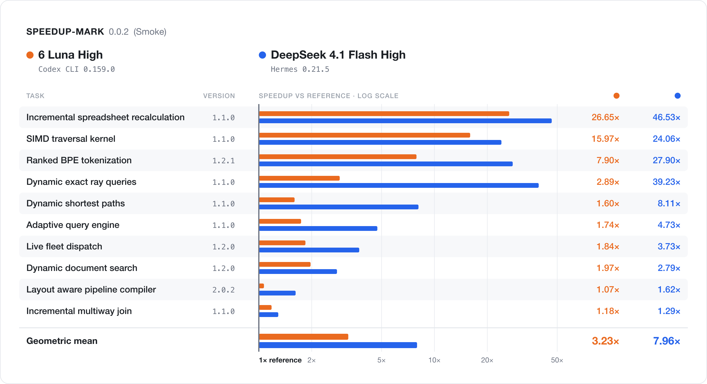

# SPEEDUP-MARK

**The problem:** Most pass/fail benchmarks become stale and saturate as AI models become smarter. They measure a binary outcome.

**The goal:** Use hard optimization tasks to measure the “percent speed up” a model can achieve. These tasks are designed to be attempted by any model but provide lots of runway for even smarter models to optimize.

Models tweak and submit their `candidate.py` to a central grader, so we can track their progress over the course of a run. Each submission must preserve verified correctness.

Speedup is reference cost divided by candidate cost: **2.000x means twice as fast, a 100% speed increase**.

**Task Suites:**

- **Smoke**: 10 core tasks to quickly test agent setups.
- **Extended**: 25 tasks.
- **All**: 50 tasks.




## Prerequisites

- **Python 3.10+** and a local copy of this repository. Run commands from the repository root.
- **Standard library only** for the `smoke` and `extended` suites. Some additional tasks need the optional packages in [requirements-numerical.txt](requirements-numerical.txt).
- **Your chosen agent harness**: this repo is agnostic to the specific agent setup used.

## Usage

### Create a task run

```console
python3 -m speedupmark run create temporal_asof_join \
  --harness my-agent --model exact-model-id --effort medium
```

Give your agent the printed workspace path on the same machine. It reads `prompt.md` and the task README, edits `candidate.py`, and submits each attempt by running this command inside the workspace:

```console
python3 grade.py
```

When the agent stops, finish the run and view its results from the repository root:

```console
python3 -m speedupmark run finish runs/<id>
```

### Run a suite with your agent

Supply your harness’s noninteractive command, configured for the model and effort you record:

```console
python3 -m speedupmark run launch smoke \
  --harness my-agent --model exact-model-id --effort medium \
  --command my-agent
```

Replace `my-agent` with your harness command. The prompt is passed on stdin; each task gets a fresh workspace. Use a suite name or task name to select the tasks you would like to run.

View the suite results using the printed suite path:

```console
python3 -m speedupmark run report runs/suite-<id>
```

Reports include progress measurements and final scores. Final grading selects the fastest correct recorded candidate and evaluates it on fresh seeds by default. Timing comparisons need the same machine and Python version.

### Commands

| Command | Purpose |
| --- | --- |
| `python3 -m speedupmark all --list` | List all 50 tasks |
| `python3 grade.py` | Submit the candidate and record progress from inside a run workspace |
| `python3 -m speedupmark run evaluate runs/<id>` | Submit the workspace candidate from the repository root |
| `python3 -m speedupmark run finish runs/<id>` | Finish a manually handed off run and grade its best verified candidate |
| `python3 -m speedupmark run report runs/<id>` | View a task run’s progress and results |
| `python3 -m speedupmark run report runs/suite-<id>` | View suite results; add `--json` for the full report |
| `python3 -m speedupmark temporal_asof_join` | Grade the local candidate directly |
| `python3 -m speedupmark --json > results.json` | Save direct smoke suite grading results |
| `python3 -m speedupmark run --help` | Show run commands and options |

Grading uses three samples and fresh seeds by default. Use `--seed` to replay a batch and `--samples` to change the sample count. Direct grading evaluates local candidates without launching a model.

## Task List

`smoke` contains 10 tasks. `extended` includes those 10 plus 15 more. `all` includes all 50 benchmark tasks below. Each task links to its full contract; use its directory name to run it individually.

| Task | Workload | Included in |
| --- | --- | --- |
| [Incremental Spreadsheet Recalculation](tasks/incremental_spreadsheet_recalculation/README.md) | Dependency invalidation and selective recomputation: answer cell queries without recalculating unchanged spreadsheet regions | smoke, extended, all |
| [Battery-Limited Fleet Tours](tasks/live_fleet_dispatch/README.md) | Resource constrained routing and fleet allocation: minimize battery limited tour time plus unserved job penalties on changing roads | smoke, extended, all |
| [Incremental Weighted Multiway Join](tasks/incremental_multiway_join/README.md) | Incremental join maintenance: balance weighted triangle deltas and cached partial joins under skew and update bursts | smoke, extended, all |
| [Ranked Byte-Pair Tokenization](tasks/ranked_bpe_tokenization/README.md) | Dynamic sequence maintenance: track the next ranked byte pair merge without repeatedly scanning and rebuilding the token list | smoke, extended, all |
| [Dynamic Exact Ray Queries](tasks/dynamic_exact_ray_queries/README.md) | Dynamic spatial indexing: balance hierarchy construction, refits, and exact nearest hit search as triangles change | smoke, extended, all |
| [Dynamic Ranked Document Search](tasks/dynamic_document_search/README.md) | Mutable inverted indexing and exact top k selection: balance posting updates against ranked document query cost | smoke, extended, all |
| [Dynamic Shortest-Path Query Engine](tasks/dynamic_shortest_paths/README.md) | Dynamic shortest path maintenance: balance search, distance cache reuse, invalidation, and repair under graph updates | smoke, extended, all |
| [Adaptive Query Engine](tasks/adaptive_query_engine/README.md) | Relational query optimization: choose predicate placement, join order, indexes, and shared computation across query plans | smoke, extended, all |
| [Layout-Aware Pipeline Compiler](tasks/layout_aware_pipeline_compiler/README.md) | Joint tensor fusion, layout, and scheduling: minimize simulated cycles under scratch memory, bank, and issue limits | smoke, extended, all |
| [SIMD Traversal Kernel](tasks/simd_traversal_kernel/README.md) | Latency hiding SIMD scheduling: balance traversal interleaving, table caching, banked gathers, and limited scratch; simulated cycles | smoke, extended, all |
| [Temporal Per-Entity As-Of Join](tasks/temporal_asof_join/README.md) | Temporal indexing and batch joins: match each event to its latest eligible entity row while preserving duplicate tie rules | extended, all |
| [Multi-Literal Replacement](tasks/multi_literal_replacement/README.md) | Overlapping multi pattern search: balance index construction and scanning while preserving longest matches across byte chunks | extended, all |
| [Grouped Analytics Reports](tasks/grouped_analytics_reports/README.md) | Shared aggregation planning: fuse grouping, distinct tracking, and sorting across three reports while preserving SQL NULL rules | extended, all |
| [Checksummed Durable Log Recovery](tasks/durable_log_recovery/README.md) | Validation constrained recovery: reduce checksum copying and duplicate bookkeeping while preserving the exact durable log prefix | extended, all |
| [Vertex-Labeled Graph Isomorphism](tasks/labeled_graph_isomorphism/README.md) | Exact graph matching: combine label refinement, search ordering, and symmetry pruning to find a mapping or prove none exists | all |
| [Integer Factorization](tasks/integer_factorization/README.md) | Semiprime factor search: choose factoring methods and batch modular arithmetic for bounded factors with differing structure | extended, all |
| [Minimum Spanning Tree](tasks/minimum_spanning_tree/README.md) | Minimum weight graph connectivity: choose edge ordering, heaps, and disjoint set structures for graphs of differing density | extended, all |
| [Articulation Points](tasks/articulation_points/README.md) | Graph separation analysis: find cut vertices with low link traversal instead of repeating connectivity checks after each removal | extended, all |
| [Exact Minimum Weight Assignment](tasks/min_weight_assignment/README.md) | Exact bipartite assignment: minimize total cost through augmenting paths, dual potentials, and efficient slack updates | extended, all |
| [Exact k-Nearest Neighbors](tasks/exact_k_nearest_neighbors/README.md) | Exact geometric search: balance spatial index construction, distance pruning, and selection without losing tied neighbors | extended, all |
| [Exact Minimum Cost Maximum Flow](tasks/min_cost_max_flow/README.md) | Residual network optimization: maximize flow, then minimize cost through augmentations, reverse arcs, and shortest path potentials | extended, all |
| [Gzip Compression](tasks/gzip_compression/README.md) | Compression speed versus size: choose compression policies that preserve an exact round trip within the compressed size ceiling | extended, all |
| [Exact Integer Matrix Multiplication](tasks/matrix_multiplication/README.md) | Exact matrix product algorithm selection: balance sparse expansion, blocking, integer packing, and conversion across matrix shapes | extended, all |
| [Queens With Obstacles](tasks/queens_with_obstacles/README.md) | Maximum independent set on queen attack graphs: find the largest nonattacking placement with obstacle blocked attacks | extended, all |
| [Multi-Pattern Matching](tasks/multi_pattern_matching/README.md) | Automaton compilation versus scanning: choose shared states, literal filters, and representations for exact matches across byte chunks | extended, all |
| [Exact Near-Duplicate Document Clustering](tasks/near_duplicate_document_clustering/README.md) | Exact set similarity joins: prune document pairs without missing Jaccard threshold edges, then compute connected components | extended, all |
| [Capacitated Facility Location](tasks/capacitated_facility_location/README.md) | Coupled facility opening and assignment: minimize fixed and service costs while fitting indivisible customers into shared capacities | all |
| [Delaunay Triangulation](tasks/delaunay/README.md) | Robust geometric construction: balance point location, local triangulation updates, and exact orientation and incircle checks | all |
| [Prime-Field Discrete Logarithm](tasks/discrete_log/README.md) | Finite group exponent recovery: exploit subgroup orders and balance modular search time against lookup table memory | all |
| [Earth Mover's Distance](tasks/earth_movers_distance/README.md) | Unregularized optimal transport: minimize mass moving cost while exploiting transport constraints, sparsity, and reduced cost structure | all |
| [Exact Integer Convolution](tasks/exact_integer_convolution/README.md) | Exact polynomial multiplication: choose sparse, packed integer, or transform methods while reconstructing every signed coefficient exactly | all |
| [Graph Coloring](tasks/graph_coloring/README.md) | Minimum graph coloring: combine clique bounds, vertex ordering, and symmetry pruning to prove the fewest colors | all |
| [Logistic Group Lasso](tasks/group_lasso/README.md) | Nonsmooth convex optimization: balance logistic loss steps, group sparsity, active set screening, and convergence | all |
| [Fixed-Route Job-Shop Makespan](tasks/job_shop_scheduling/README.md) | Precedence constrained resource scheduling: minimize makespan while jointly choosing exclusive machine orders and respecting job routes | all |
| [Spectral-Radius Matrix Completion](tasks/spectral_radius_matrix_completion/README.md) | Log domain convex completion: minimize the Perron root under fixed observations and a product one constraint on missing entries | all |
| [Three-Resource 0/1 Knapsack](tasks/multi_dim_knapsack/README.md) | Multidimensional subset optimization: maximize profit under three resource limits using bounds, dominance pruning, and state selection | all |
| [Robertson Chemical Kinetics](tasks/ode_stiff_robertson/README.md) | Stiff chemical integration: balance implicit solves, Jacobian work, and error control across widely separated reaction timescales | all |
| [Out-of-Order Session Window Trace](tasks/out_of_order_session_windows/README.md) | Dynamic interval merging and expiry: maintain exact session traces under out of order events, watermarks, and late event rules | all |
| [Sparse Weighted PageRank](tasks/pagerank/README.md) | Sparse fixed point convergence: balance graph representation, iteration cost, and convergence while handling dangling vertices | all |
| [1D Viscous Burgers Equation](tasks/pde_burgers1d/README.md) | Stiff nonlinear PDE integration: exploit the sparse spatial Jacobian while balancing advection, diffusion, and time step accuracy | all |
| [Low-Rank Matrix Approximation](tasks/low_rank_approximation/README.md) | Accuracy constrained low rank factorization: balance matrix passes, subspace iteration, and orthogonalization within the reconstruction bound | all |
| [RBF Interpolation](tasks/rbf_interpolation/README.md) | Structured kernel system solving: balance kernel assembly, constrained factorization, and batched prediction while preserving interpolation accuracy | all |
| [Robust State Estimation](tasks/robust_kalman_filter/README.md) | Robust convex trajectory estimation: exploit temporal structure while minimizing process noise and Huber measurement loss | all |
| [Minimum Fuel Rocket Landing](tasks/rocket_landing_optimization/README.md) | Constrained optimal control: minimize fuel with coupled trajectory dynamics, landing conditions, altitude, and thrust limits | all |
| [Scratchpad Dataflow Compiler](tasks/scratchpad_dataflow_compiler/README.md) | Joint instruction scheduling and storage allocation: balance spilling, recomputation, fusion, and bank conflicts; simulated cycles | all |
| [Entropy-Regularized Transport](tasks/sinkhorn/README.md) | Entropy regularized matrix scaling: balance convergence and numerical stability while satisfying transport marginals and the Gibbs condition | all |
| [Smallest Eigenvalues of Sparse SPD Matrices](tasks/smallest_eigenvalues_sparse_spd/README.md) | Sparse extremal eigensolving: balance Krylov iteration, preconditioning, and shift invert factorization for clustered or ill conditioned spectra | all |
| [Asymmetric Traveling Salesperson](tasks/asymmetric_tsp/README.md) | Exact directed tour optimization: combine bounds and search for small cases, and recover assignment tight Hamiltonian tours for larger cases | all |
| [Vehicle Routing](tasks/vehicle_routing/README.md) | Joint customer partitioning and tour optimization: minimize total distance over exactly K nonempty depot returning routes | all |
| [Exact Affine Gap Sequence Alignment](tasks/affine_gap_sequence_alignment/README.md) | Exact edit path optimization: balance full dynamic programming, wavefront search, and pruning across sparse edits, long gaps, and dense differences | all |

## Inspiration

- [AlgoTune](https://github.com/oripress/AlgoTune)
- [Anthropic’s original performance take-home](https://github.com/anthropics/original_performance_takehome)
